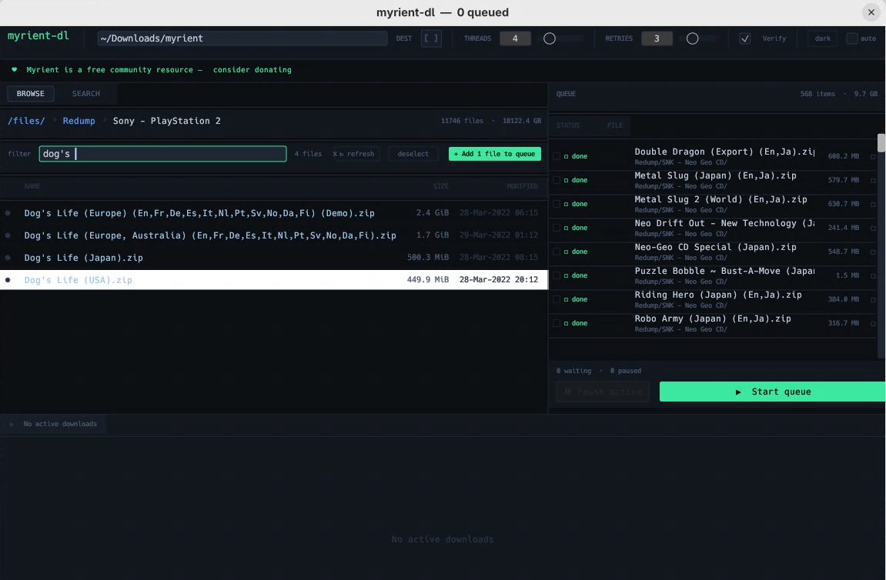
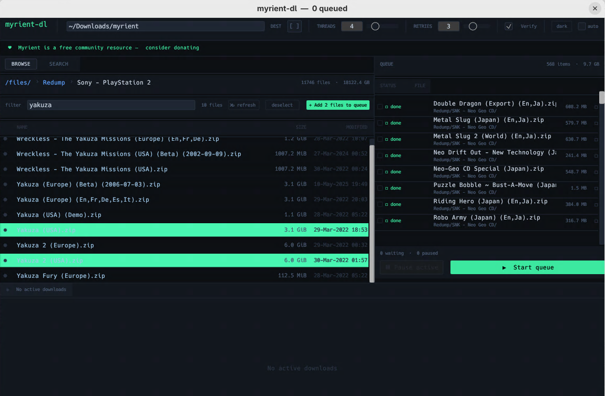
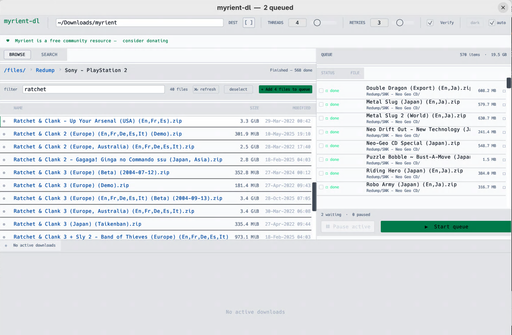
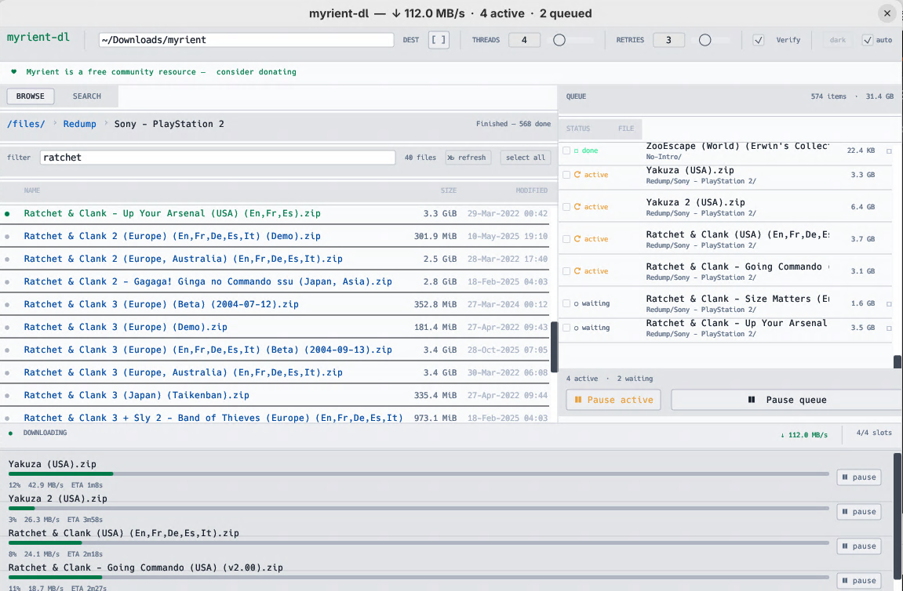

<p align="center">
  
</p>

<p align="center">
  <strong>A native cross-platform desktop downloader for <a href="https://myrient.erista.me">myrient.erista.me</a></strong><br/>
  Built with Rust + egui. No browser. No Python. No external tools. One binary.
</p>

<p align="center">
  
  
  
</p>

---

## Screenshots

<table>
  <tr>
    <td></td>
    <td></td>
  </tr>
  <tr>
    <td><em>Filter bar narrows results instantly; click files to select them</em></td>
    <td><em>Multi-select with shift-click; queue everything at once</em></td>
  </tr>
  <tr>
    <td></td>
    <td></td>
  </tr>
  <tr>
    <td><em>Queue panel shows status at a glance; start when ready</em></td>
    <td><em>Live progress bars, speed, and ETA per download</em></td>
  </tr>
</table>

---

## What is this?

**myrient-dl** lets you browse and download from [Myrient](https://myrient.erista.me) — a free community preservation archive hosting ROM sets, disc images, and software collections — without using a browser.

The entire Myrient directory tree is embedded in the app as a compressed index, so browsing is instant with no network requests. Folders not in the index are fetched live and cached locally for future use. Downloads run concurrently with resume support, retries, and optional checksum verification.

Also ships a full terminal UI (`myrient-dl-cli`) for headless or scripted use.

---

## Installation

### Pre-built binaries

Download the latest release from the [Releases](../../releases) page.

| Platform | GUI | CLI |
|----------|-----|-----|
| Linux x86_64 | `myrient-dl-linux-x86_64` | `myrient-dl-cli-linux-x86_64` |
| Windows x86_64 | `myrient-dl-windows-x86_64.exe` | `myrient-dl-cli-windows-x86_64.exe` |
| macOS Universal | `myrient-dl.app.zip` | `myrient-dl-cli-macos-universal` |

> **Windows:** right-click → Run anyway to bypass SmartScreen on first launch.
>
> **macOS:** unzip `myrient-dl.app.zip`, drag `myrient-dl.app` to Applications. Right-click → Open on first launch to bypass Gatekeeper.
>
> **Linux:** `chmod +x myrient-dl-linux-x86_64` then run.

### Build from source

**Linux prerequisites:**
```bash
# Fedora / RHEL
sudo dnf install rust cargo openssl-devel gtk3-devel \
                 wayland-devel libxkbcommon-devel mesa-libGL-devel \
                 libX11-devel libXcursor-devel libXrandr-devel libXi-devel

# Ubuntu / Debian
sudo apt install cargo libssl-dev libgtk-3-dev \
                 libwayland-dev libxkbcommon-dev libgl1-mesa-dev \
                 libx11-dev libxcursor-dev libxrandr-dev libxi-dev
```

```bash
git clone https://github.com/yourusername/myrient-dl
cd myrient-dl
cargo build --release
./target/release/myrient-dl
```

---

## GUI usage

### Browsing & filtering

Navigate the folder tree using the breadcrumb trail at the top. Type in the **filter bar** to narrow the current directory — results update instantly. Click **↻ refresh** to re-fetch the current folder from the server if you need up-to-date listings.

### Selecting files

- **Click** a file to select it (click again to deselect)
- **Ctrl/Cmd+click** to add to an existing selection
- **Shift+click** to select a range
- **Select all** selects all visible files, respecting the active filter
- Folder rows have a checkbox on the left — checking a folder queues its entire contents

### Queuing & downloading

Once you have files selected, click **+ Add N files to queue**. Use the queue panel on the right to manage downloads:

- **Start queue** / **Pause queue** — start or pause all pending downloads
- **Pause active** — pause in-progress downloads (they resume from where they left off)
- Click a queued item to select it; shift-click for ranges
- **Remove selected** — remove the selected items
- **Remove unselected (N kept)** — remove everything *except* your selection

### Search

Switch to the **Search** tab to search across the entire Myrient tree instantly. Just type naturally — spaces and special characters like `(`, `,`, `'` are handled automatically.

- Use **only** to filter results to a specific collection (e.g. `No-Intro`, `Redump`)
- Use **exclude** to hide results from a collection (e.g. `BIOS`)
- Hover a result and click **+** to queue it, or **→** to navigate to its folder with the file pre-selected
- Click a result row to select it; Ctrl+click or shift+click to select multiple, then **+ queue all selected**

### Settings

| Setting | Default | Description |
|---------|---------|-------------|
| Dest | `~/Downloads/myrient` | Root folder for all downloads |
| Threads | 4 | Simultaneous downloads (1–16) |
| Retries | 3 | Retry attempts on failure |
| Verify | on | Fetch and verify MD5 checksums after download |
| Theme | dark | `dark` / `light` / `auto` (follows OS) |

---

## CLI usage (`myrient-dl-cli`)

A full terminal UI sharing the same download engine, queue file, and settings as the GUI.

```bash
./myrient-dl-cli-linux-x86_64
```

The CLI auto-detects Unicode support — symbols like `▶ ✓ ›` are used on capable terminals, with ASCII fallbacks (`> + >`) on Windows CMD and other limited terminals.

### Key bindings

| Key | Action |
|-----|--------|
| `↑` `↓` `j` `k` | Navigate list |
| `Enter` / `l` / `→` | Open folder or queue file |
| `Backspace` / `h` / `←` | Go back |
| `Space` | Select / deselect file; queue highlighted search result |
| `a` | Select all visible files |
| `A` | Deselect all |
| `q` | Queue selected files; or queue all files in a folder if cursor is on a folder |
| `f` | Filter current directory |
| `/` | Search across entire tree |
| `R` | Refresh current folder from server |
| `Tab` | Switch browser / queue panes |
| `s` | Start / pause queue |
| `x` | Remove selected queue items |
| `+` / `-` | Increase / decrease concurrent download threads |
| `[` / `]` | Decrease / increase retry count |
| `Q` or `Ctrl+C` | Quit |

---

## How the directory index works

The full Myrient directory tree is bundled into the app as a compressed index. This makes browsing instant without any network requests.

When you visit a folder not in the index (e.g. newly added collections), the app fetches it live via HTTP and saves it to `~/.local/share/myrient-dl/generated_dirs.bin`. That local cache is checked first on all future visits, so each folder only needs one HTTP fetch.

Use **↻ refresh** (GUI) or `R` (CLI) to force a re-fetch of the current folder and update the local cache with the latest server contents.

---

## License

MIT — see [LICENSE](LICENSE)

---

## Acknowledgements

[Myrient](https://myrient.erista.me) is a free, community-run preservation archive. Please [consider donating](https://myrient.erista.me/donate/) to help keep it running.

---

## Architecture

```
┌─────────────┐   browse    ┌─────────────────────────────┐
│  egui UI    │ ── thread ─▶│  reqwest + scraper          │
│  (main      │             │  (worker thread per nav)    │
│   thread)   │◀─ Mutex ───│                             │
└──────┬──────┘             └─────────────────────────────┘
       │                    ┌─────────────────────────────┐
       │                    │  generated_dirs.bin         │
       │                    │  (zstd per-folder blocks,   │
       │                    │   local file auto-updated)  │
       │                    └─────────────────────────────┘
       │ DlCmd channel
       ▼
┌─────────────────┐  semaphore  ┌──────────────────────┐
│ Download manager│ ───────────▶│  reqwest streaming   │
│ thread          │             │  (one thread/job)    │
│                 │◀─ progress─│  Range: resume       │
└─────────────────┘             └──────────────────────┘
```

---

## Rebuilding the directory index

The embedded `generated_dirs.bin` bundles pre-crawled folder listings and sizes. It's built by `src/bin/fetch_sizes.rs`, which crawls Myrient via HTTP, computes recursive folder sizes, and encodes everything into the compressed block format.

```bash
# Full crawl from scratch (several hours, resumes if interrupted):
cargo run --bin fetch_sizes

# Re-crawl only folders whose modification date changed on the server:
cargo run --bin fetch_sizes -- --refresh

# Rebuild the binary data file from existing crawl cache without re-fetching:
cargo run --bin fetch_sizes -- --dirs-only

# Then rebuild the app to embed the new data:
cargo build --release
```

The crawler checkpoints to `fetch_sizes_cache.json`. Without running `fetch_sizes`, the app still works fully — navigation makes live HTTP requests for unknown folders and persists them locally, but folder sizes won't be pre-calculated.

---

## Dependencies

| Crate | Purpose |
|-------|---------|
| `eframe` / `egui` | Native GUI |
| `reqwest` | HTTP client — browsing and downloading |
| `scraper` | HTML parsing for live directory fetches |
| `serde` / `serde_json` | Settings, queue persistence |
| `zstd` | Block compression for `generated_dirs.bin` |
| `shellexpand` | `~/` path expansion |
| `rfd` | Native folder picker dialog |
| `md5` | Checksum verification |
| `libc` | `statvfs` disk space (Unix) |
| `windows-sys` | `GetDiskFreeSpaceExW` (Windows) |
| `rayon` | Parallel crawling in `fetch_sizes` |
| `ratatui` / `crossterm` | Terminal UI for CLI mode |

---

## Contributing

Pull requests welcome. Some ideas:

- **Import/export** queue as a plain URL list
- **Torrent support** — Myrient provides `.torrent` files for some collections
- **Desktop notifications** on completion
- **Bandwidth limiting** per job or globally
